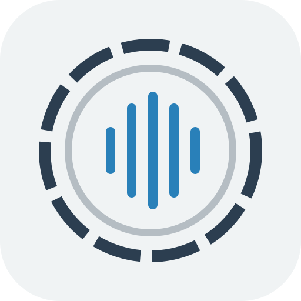
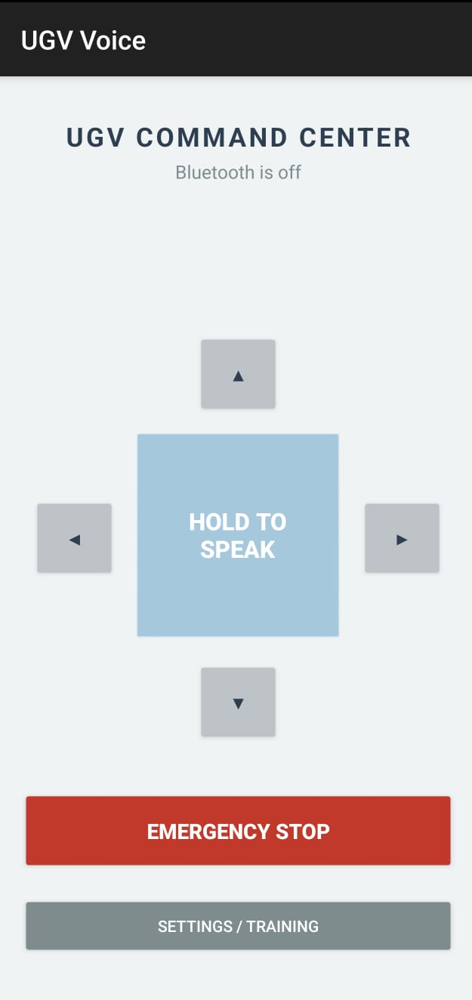
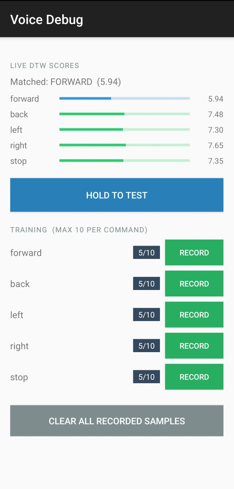
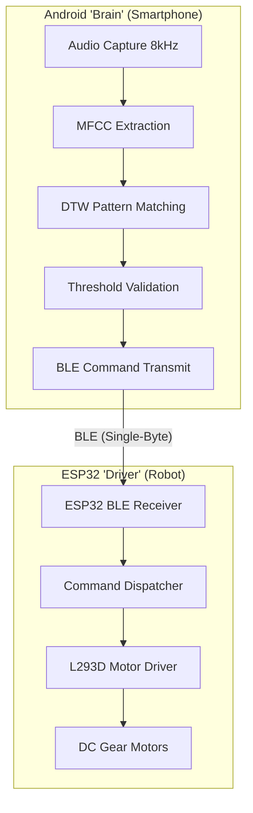
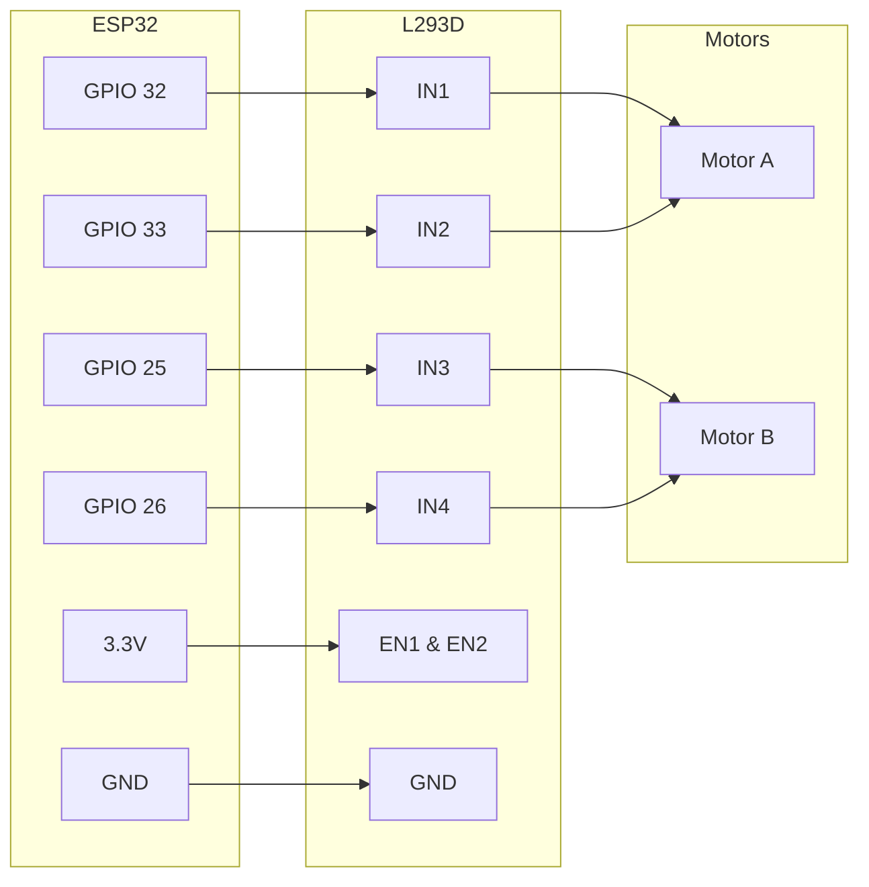

# 🛰️ Voice-Controlled UGV (Unmanned Ground Vehicle)

  

A sophisticated, **100% offline**, voice-controlled robotics platform that combines embedded systems, mobile application development, and advanced digital signal processing. This project allows users to control a differential-drive vehicle using natural voice commands processed locally on an Android device and transmitted via an optimized Bluetooth Low Energy (BLE) protocol.

---

## 📋 Table of Contents
- [📦 Download](#-download)
- [🚀 Key Features](#-key-features)
- [📱 App Interface](#-app-interface)
- [🛠️ System Architecture](#-system-architecture)
- [🔌 Hardware Setup](#-hardware-setup)
- [⚙️ Installation & Setup](#-installation--setup)
- [🚦 Usage](#-usage)
- [📜 Development Notes](#-development-notes)
- [📜 License](#-license)

---

## 📦 Download

> [!TIP]
> **Ready to roll?** Download the latest pre-built APK from the [Releases](https://github.com/divyansh1172/voice-ugv/releases) page to get started immediately without setting up Android Studio.

---

## 🚀 Key Features

*   **Offline Voice Recognition**: No cloud dependency or internet connection required. All processing happens locally for zero latency and total privacy.
*   **Enhanced DSP Pipeline**:
    *   **Dynamic VAD (Voice Activity Detection)**: Uses a hybrid Energy + Zero-Crossing Rate (ZCR) threshold to surgically isolate speech, ensuring reliable detection of high-frequency phonemes (e.g., the "s" in "stop").
    *   **MFCC Extraction**: Extracts Mel-frequency cepstral coefficients for robust vocal feature representation.
    *   **CMVN Normalization**: Implements Cepstral Mean and Variance Normalization to ensure recognition robustness across different hardware and volume levels.
    *   **Delta-Delta Coefficients**: Captures vocal acceleration features to distinguish between similar-sounding commands (e.g., "Left" vs "Right").
*   **Optimized Pattern Matching**:
    *   **Dynamic DTW**: Uses Dynamic Time Warping with a flexible Sakoe-Chiba band to accommodate variations in speaking speed.
    *   **Parallelized Computation**: Leverages multi-core Android CPUs via `ExecutorService` to perform matching across all templates in parallel, achieving ~20ms latency.
    *   **Best-of-N Strategy**: Supports up to 10 personalized voice templates per command for user adaptation.
*   **Low-Latency BLE Protocol**:
    *   **Optimized Capture**: Uses a fixed 1.5-second (12,000 samples) window for rapid command response.
    *   **Single-Byte Architecture**: Uses character codes ('f', 'b', 'l', 'r', 's') to minimize transmission overhead and parsing jitter.
*   **Professional Controller UI**: 
    *   Modern, high-contrast interface with real-time status feedback.
    *   Joystick-style manual overrides and Emergency STOP safety button.
    *   Hardware-level Noise Suppression and Auto-Gain Control (AGC).

---

## 📱 App Interface

  
  &nbsp;&nbsp;&nbsp;&nbsp;
  
   
  <i>Left: The primary control interface with Emergency STOP. Right: The debug screen for signal analysis and template training.</i>

---

## 🛠️ System Architecture

The project is split into two specialized nodes:

### Data Flow Pipeline

### 1. Android "Brain" App (`android_app`)
*   **Role**: Handles audio capture (8kHz mono), signal processing, and decision-making.
*   **DSP Stack**: Java-native implementation of FFT, Mel-Filterbanks, and DTW.
*   **Optimizations**: Parallelized matching across CPU cores; Hardware-level audio pre-processing.

### 2. ESP32 "Driver" Firmware (`esp32_firmware`)
*   **Role**: Manages low-level motor control and BLE communication.
*   **Hardware**: ESP32 Microcontroller, L293D Motor Driver, DC Gear Motors.
*   **Protocol**: Lightweight BLE GATT service with character-code command dispatch.

---

## 🔌 Hardware Setup

### Wiring Schematic
The following diagram illustrates the connections between the ESP32, the L293D motor driver, and the DC motors.

### Components List
| Component | Purpose |
| :--- | :--- |
| **ESP32 DevKit V1** | Main Microcontroller & BLE Hub |
| **L293D IC** | Dual H-Bridge Motor Driver |
| **UGV Chassis** | 2WD or 4WD Differential Drive |
| **Li-ion Battery** | 7.4V - 12V Power Supply |
| **Android Smartphone** | Primary Controller & DSP Node |

---

## ⚙️ Installation & Setup

### Android App
1.  Open the `android_app` folder in **Android Studio** (Hedgehog or later).
2.  Build and install the APK onto your device.
3.  The app features a custom **Adaptive Icon** for easy identification on your home screen.
4.  Grant **Microphone** and **Bluetooth** permissions upon launch.

### ESP32 Firmware
1.  Open the `esp32_firmware` folder in VS Code with the **PlatformIO** extension.
2.  Connect your ESP32 via USB and click **Upload**.
3.  The firmware includes a MAC spoofing layer to ensure seamless pairing with the app's hardcoded target.

---

## 🚦 Usage
1.  **Power On**: Turn on the UGV and launch the app. The status bar will turn **Green** when connected.
2.  **Training**: Go to "Settings/Training". For best results, record 5-10 samples per command in a quiet room. 
3.  **Control**: Hold the **Blue Speak Button** and say a command. The robot reacts within ~20ms of the phone finishing the DSP calculation.
4.  **Emergency**: Hit the **Large Red STOP Button** to kill all motor activity instantly.

---

## 📜 Development Notes
This project demonstrates high-performance edge computing. Recent optimizations have transitioned the communication from string-based parsing to a single-byte protocol, and enhanced the VAD algorithm with spectral analysis for superior robustness in real-world environments.

---

## 📜 License
This project is licensed under the MIT License - see the [LICENSE](LICENSE) file for details.

---

*Developed by Divyansh Maheshwari and Shriyansh Chawda*
